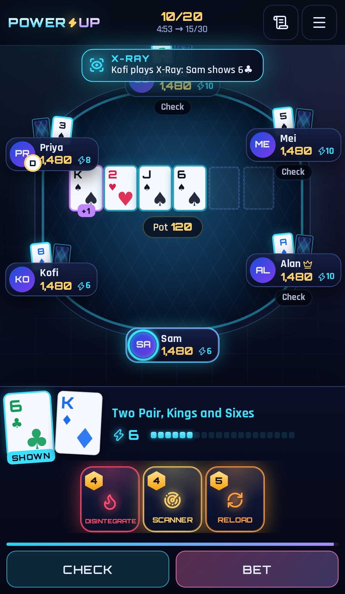
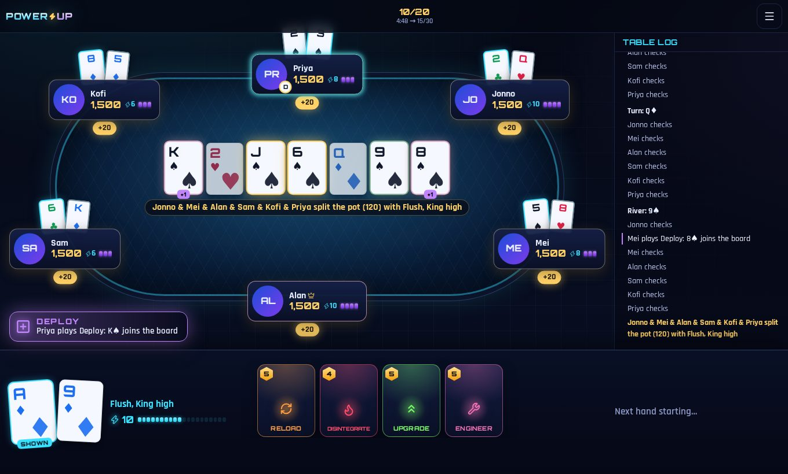

# PowerUp ⚡

Texas hold'em with game-changing powers: a fan-made recreation of PokerStars' **Power Up**, built for
friends. Create a table, share the link, and everyone joins with just a name. No accounts, no downloads,
play money only.

Runs entirely on Cloudflare: a Worker serves the app and each table lives in its own Durable Object.

<p align="center">
  
  &nbsp;
  
</p>

## How it works for players

1. **Create a table.** Pick your name, seats (2–6), starting chips, starting blinds, how often blinds go up,
   rebuys per player, time to act and (optionally) which powers are in play.
2. **Share the link** (`https://your-domain/t/<table-id>`). Friends open it, type a name and take a seat.
3. **The host presses Start.** Seats lock; anyone else with the link can watch.
4. Play until one player has all the chips. Busted players can rebuy while they have rebuys left.
   The host can pause, and can start a rematch with the same players at the end.

Your seat is remembered in your browser. To move to another device, use **Menu → Copy my seat link**.

## Rules

PowerUp is no-limit hold'em: two hole cards, flop, turn, river, best five-card hand wins. It's a sit & go
tournament. Everyone starts with the same stack, blinds rise on a timer, and the last player with chips wins.

On top of that everyone holds **powers**, following the official PokerStars guide:

- You start with **10 energy** and gain **+2 at the start of every hand**, up to a maximum (15 classic / 20 double).
- You hold **3 different powers** (4 in a Double game). Used powers are replaced at the start of the next
  hand. You never hold duplicates, except by using Clone.
- Powers are played **on your turn, before you bet**. You can play several in one turn if you have the energy.
- **All-in shield:** when anyone goes all-in, every card already on the board is locked (shown in red) and
  can't be targeted by powers.

| Power | Cost (classic / double) | Effect |
| --- | --- | --- |
| X-Ray | 2 / 4 | Every opponent in the hand exposes one random hole card to the whole table. |
| Upgrade | 5 | Draw a third hole card, then discard one. |
| Scanner | 4 | Privately see the top two cards of the deck; you may discard one. Opponents see whether you discarded, not which. |
| Reload | 5 | Swap one or both of your hole cards for new ones. |
| Intel | 3 | See the top card of the deck for the rest of the hand. |
| Engineer | 5 | The next three cards are shown to everyone. You choose which comes next; the other two are discarded. |
| EMP | 3 / 4 | Opponents can't play powers for the rest of this street. You still can. |
| Disintegrate | 4 | Destroy a board card dealt this street; the top card of the deck replaces it. |
| Clone | 2 | Get a copy of the last power played this hand. |
| Deploy | 3 / 2 | Add the top card of the deck to the board as an extra community card (max two per hand). |

Deploy was added to the live game after the original nine; the host can switch any power off when creating a table.

### The Double game (4–6 players)

The original is strictly three-handed. With twice as many opponents, tables that **start with 4–6 players**
use rebalanced rules:

- **4 powers** in hand and a **20 energy** cap, so there's room to combo in bigger pots.
- **X-Ray costs 4.** It can reveal up to five hands, not two.
- **EMP costs 4 and is dealt half as often.** It silences up to five players at once.
- **Deploy costs 2.** The extra card now helps more opponents, so it's worth less to you.

A card-drawing power can't be played if it would leave too few cards to finish the board, so the deck
never runs dry even at six-handed with every power flying.

## Tech

```
Browser (React SPA) ──WebSocket──▶ Worker ──▶ Durable Object "PowerUpTable" (one per table)
                      POST /api/tables          ├─ game engine (pure TypeScript)
                                                ├─ SQLite-backed storage (table state)
                                                └─ alarms (turn clock, runouts, next hand, cleanup)
```

- **`src/engine/`**: the complete game as a deterministic, pure TypeScript state machine: NLHE betting
  (incomplete all-in raises, side pots, odd chips, uncalled bets), blind levels, busts/rebuys/placements,
  timeouts, and all ten powers. `view.ts` builds each player's personalised view, which is the only thing sent
  to browsers, so hidden cards, the deck and seat tokens never leave the server.
- **`src/worker/`**: the Worker routes (`POST /api/tables`, `GET /api/tables/:id/ws`) and the
  `PowerUpTable` Durable Object. It uses hibernatable WebSockets (idle tables cost nothing), persists state
  after every change, rolls back on errors, pauses a game when everyone has left, and deletes tables idle
  for 3 days.
- **`src/client/`**: React UI (Vite), mobile-first, with self-hosted fonts (SIL OFL).
- Accountless identity: joining returns a random seat token stored in `localStorage`. Whoever holds the
  token owns the seat.

## Development

```sh
npm install
npm run dev          # Vite + the Worker/Durable Object running locally in workerd → http://localhost:5173
npm test             # engine unit tests, including randomised full games
npm run typecheck
node scripts/bots.ts --players 6   # bots play a full game against the dev server
```

## Deploying to Cloudflare

Durable Objects with SQLite storage are available on the Workers **Free** plan, so no paid plan is needed.
The Free plan allows 100,000 Durable Object row writes per day. A table writes roughly once per action, so
that's plenty of home games a day; the Workers Paid plan lifts the limit if you ever need it.

**From your machine**

```sh
npx wrangler login
npm run deploy       # builds, then `wrangler deploy`
```

Wrangler prints your URL (`https://powerup.<your-subdomain>.workers.dev`). Add a custom domain under
*Workers & Pages → powerup → Settings → Domains & Routes*.

**Or from GitHub (Workers Builds)**: in the Cloudflare dashboard go to *Workers & Pages → Create →
Import a repository*, pick this repo, and set:

- Build command: `npm run build`
- Deploy command: `npx wrangler deploy`

Every push to the production branch then deploys automatically.

## Credits

A fan-made recreation of PokerStars' Power Up for private games with friends. Not affiliated with or endorsed
by PokerStars. No real money is involved. Fonts: Orbitron (The Orbitron Project Authors) and Rajdhani
(Indian Type Foundry), both under the SIL Open Font License.
